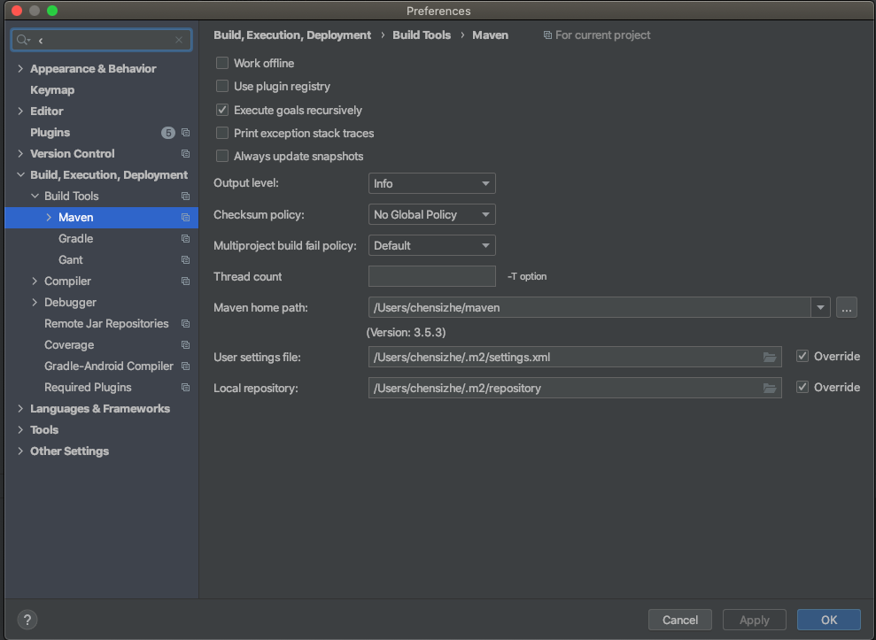
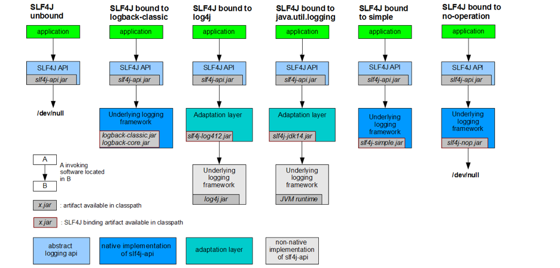

## 	spring boot 学习

### 环境 配置

#### maven 环境配置

1. 给maven的settings.xml 配置文件追加profiles 标签

```xml
<profiles>
    <profile>
        <id>jdk-1.8</id>
        <activation>
            <activeByDefault>true</activeByDefault>
            <jdk>1.8</jdk>
        </activation>
        <properties>
            <maven.compiler.souce>1.8</maven.compiler.souce>
            <maven.compiler.target>1.8</maven.compiler.target>
            <maven.compiler.comilerVersion>1.8</maven.compiler.comilerVersion>
        </properties>
    </profile>
</profiles>
```

#### idea 中配置maven



#### 导入Springboot 的依赖

```xml
<parent>
    <groupId>org.springframework.boot</groupId>
    <artifactId>spring-boot-starter-parent</artifactId>
    <version>1.5.9.RELEASE</version>
</parent>
<dependencies>
  <dependency>
  <groupId>org.springframework.boot</groupId>
  <artifactId>spring-boot-starter-web</artifactId>
  </dependency>
</dependencies>

```

#### spring boot 程序探究

1. pom.xml

   1. 父项目

      ```xml
          <parent>
              <groupId>org.springframework.boot</groupId>
              <artifactId>spring-boot-starter-parent</artifactId>
              <version>2.0.1.RELEASE</version>
          </parent>
      他的父项目
          <parent>
              <groupId>org.springframework.boot</groupId>
              <artifactId>spring-boot-dependencies</artifactId>
              <version>2.0.1.RELEASE</version>
              <relativePath>../../spring-boot-dependencies</relativePath>
          </parent>
      他来真正的管理Springboot 项目的依赖
      ```

      springboot 的仲裁中心，以后导入依赖默认时不需要写版本的。

   2. 导入依赖

      ```xml
      <dependency>
          <groupId>org.springframework.boot</groupId>
          <artifactId>spring-boot-starter-web</artifactId>
      </dependency>
      ```

      Spring-boot-starter : spring-boot 场景启动器，当启动web时，帮我们导入web模块儿正常运行所依赖的组件。

      spring boot 将所有的功能场景都抽取出来做成starter，只需要导入starter，相关场景的starter 都会导入进来。要用什么功能，就导入什么场景启动器。

2. spring boot 主程序

   ```java
   @SpringBootApplication
   @RestController
   public class HelloWorldBootStrap {
       public static void main(String[] args) {
           SpringApplication.run(HelloWorldBootStrap.class,args);
       }
   
       @GetMapping("/hello-world")
       public String helloWorld(){
           return "hello world";
       }
   }
   ```

   1. @SpringBootApplication 说明这个类是spring boot 的主程序类。

   2. @SpringBootApplicaiton是一个组合注解

      1. @SpringBootConfiguration,标注在某个类上，表示这是一个Spring boot 的配置类，他是通过**@Configuration**注解实现的。

      2. @EnableAutoConfiguation，启动自动配置。

         1. @AutoConfigurationPackage 用来将 主配置类所在包的所有类扫描到Spring容器中

            1. ```
               @Import(AutoConfigurationPackages.Registrar.class)
               ```

3. resource 目录中目录结构
   1. static ：css，js，imges 等静态资源
   2. templates：所有的模版页面（spring boot 使用jar包，嵌入式的Tomcat 默认不支持jsp），可以使用模版引擎，thymeleaf，freemarker
      1. applicaiton.properties  :spring boot 应用的配置文件例如可用通过制定 ` server.port`  来制定端口号等，可以通过这个配置文件修改默认配置。

### Springboot的配置

#### 配置文件

1. spring boot 使用的全局配置文件
   
1. applicaiton.properties, application.yml 
   
2. yml 配置

   1. yml以数据为中心， 比xml，json更适合做配置文件
   2. 基本语法
      * key: value , 注意，冒号后必须有空格
      * 以空格的缩进来控制层级关系
      * 只要左对齐的数据，都是一个层级的数据。
      * 属性和智斗是大小写敏感

   3. 值的写法

      1. 字面量（数字，字符串，布尔）

         * key: value

         * 字符串，默认不需要双引号

         * 双引号包含的字符不会转义特殊字符，特殊字符会当作原来的字符串显示出来。

           `name：张三\nadsfasd` \n 不会转义

         * 单引号会转义

           `name：张三\nadsfasd` \n 会转义，会空行

      2.  对象，Map（属性和值）

         * k: v 在下一行来写对象的属性和值的关系，注意缩进

         * key: value

           ```yaml
           friends:
           	lastname: zhangsan
           	age: 20
           ```

         * 行内写法

           ```yaml
           friends: {lastname: zhangsan, age: 20} 
           ```

           

      3. 数组（list，set）

         * 用-  值表示，数组中的 一个 元素

         ```yaml
         pets:
          - cat
          - dog
          - pig
         ```

         * 行内写法

           ```yaml
           pets: [cat,dog,pig]
           ```

   #### application.yml 中的值注入到java bean中

   1. 利用`@ConfigurationProperties`注解告诉springboot本类中所有的所有属性和配置文件中的相关配置进行绑定。

   2. 只用这个组件在容器中的时候才能使用

      ```yaml
      person:
        lastName: zhangsan
        age: 18
        boss: false
        birth: "2017/12/12"
        maps: { key: v1, key2: 12, key3: [1,2,3]}
        lists:
          - a
          - b
          - c
          - d
          - 1
          - 2
          - 3
        dog:
          name: taotao
          age: 2
      ```

      ```java
      @Component
      @ConfigurationProperties(prefix = "person")
      public class Person {
          private String lastName;
          private Integer age;
          private boolean boss;
          private Date birth;
      
          private Map<String,Object> maps;
          private List<Object> lists;
      
          private Dog dog;
      
          public String getLastName() {
              return lastName;
          }
      
          public void setLastName(String lastName) {
              this.lastName = lastName;
          }
      
          public Integer getAge() {
              return age;
          }
      
          public void setAge(Integer age) {
              this.age = age;
          }
      
          public boolean isBoss() {
              return boss;
          }
      
          public void setBoss(boolean boss) {
              this.boss = boss;
          }
      
          public Date getBirth() {
              return birth;
          }
      
          public void setBirth(Date birth) {
              this.birth = birth;
          }
      
          public Map<String, Object> getMaps() {
              return maps;
          }
      
          public void setMaps(Map<String, Object> maps) {
              this.maps = maps;
          }
      
          public List<Object> getLists() {
              return lists;
          }
      
          public void setLists(List<Object> lists) {
              this.lists = lists;
          }
      
          public Dog getDog() {
              return dog;
          }
      
          public void setDog(Dog dog) {
              this.dog = dog;
          }
      
      
          @Override
          public String toString() {
              return "Person{" +
                      "lastName='" + lastName + '\'' +
                      ", age=" + age +
                      ", boss=" + boss +
                      ", birth=" + birth +
                      ", maps=" + maps +
                      ", lists=" + lists +
                      ", dog=" + dog +
                      '}';
          }
      }
      ```

   3. `@ConfigurationProperties`与`@Value`的区别

      |              | @ConfigurationProperties             | @Value                     |
      | ------------ | ------------------------------------ | -------------------------- |
      | 功能          | 可以批量注入配置文件的属性           | 必须一个一个置顶           |
      | 松散绑定      | 支持（字母中间采用下划线，中划线等） | 不支持（只能属性完全相同） |
      | spel         | 不支持                               | 支持                       |
      | jsr303       | 支持                                 | 不支持                     |
      | 复杂类型封装 | 支持                                 | 不支持                     |
      
   4. 配置为文件，无论是yml还是properties 都能获取到值

#### @PropertySource 和 @ImportSource

1. @PropertySource 使用来记载指定的配置文件，但是替代applicaiton.yml的时候，只能使用properties文件来替代，yml文件获取不到配置文件中的值. 例如，使用下面的方式，可是注入properties的值，到person类中，但是将yml的值注入到person对象中

   ```java
   @PropertySource("classpath:aaa.properties" )
   @ConfigurationProperties(prefix = "person")
   public class Person {
   .....
   }
   ```

   ```properties
   # aaa.properties
   person.last-name="lastname"
   
   ```

2. 如果想要使用指定的yml文件，需要在`@PropertySource` 文件的factory属性中实现解析yml的factory

   ```java
   public class YmlPropertySourceFactory implements PropertySourceFactory {
       @Override
       public PropertySource<?> createPropertySource(String name, EncodedResource resource) throws IOException {
           YamlPropertiesFactoryBean yamlPropertiesFactoryBean = new YamlPropertiesFactoryBean();
           yamlPropertiesFactoryBean.setResources(resource.getResource());
           yamlPropertiesFactoryBean.afterPropertiesSet();
           Properties object = yamlPropertiesFactoryBean.getObject();
           return  new PropertiesPropertySource(resource.getResource().getFilename(), object);
   
       }
   }
   ```

   ```java
   @Component
   @PropertySource(value = "classpath:person.yml" ,factory = YmlPropertySourceFactory.class)
   @ConfigurationProperties(prefix = "person")
   public class Person {
   }
   ```

   ```yaml
   # person.yml
   person:
     last-name: zhangsan
     age: 18
     boss: false
     birth: "2017/12/12"
     maps: { key: v1, key2: 12, key3: [1,2,3]}
     lists:
       - a
       - b
       - c
       - d
       - 1
       - 2
       - 3
     dog:
       name: taotao
       age: 2
   ```

3. 通过`@ImportSource`来导入资源文件 
   
   1. 加载bean的xml 文件，类似于@Configuration 注解的文件

#### 配置文件占位符

1. 随机数`${random.int}${random.value}${random.uuid}${random.long}${random.int(10)}${random.int[1024,65536]}`
2. 占位符获取之前配置的值。`person.lastname=${person.fistname:whenNullName}`

### Profile

1. Profile是spring对不同环境，提供不同配置功能的支持，可以通过切换指定参数，快速切换指定环境。

   * 多profile 文件形式

     1. 格式： application-{profile}.properties

        `application-dev.properties,appplication-prod.properties`

   * 多profile文档块儿模式

     ```yaml
     spring:
     	profiles:
     		active: dev
     ---
     spring:
     	profiles: dev
     server:
     	port: 80
     ---
     spring:
     	profiles: prod
     server:
     	port: 8080
     ```

2. 激活方式：

   * 命令行： --spring.profiles.active=dev
   * 配置文件： spring.profiles.active=dev(针对多profile文件的形式)
   * jvm 参数: -Dspring.profiles.active=dev

3. 配置文件的加载位置

   1. springboot会扫描一下位置的application.properties 文件，护着appplication.yml文件作为springboot 的

      默认配置文件

      1. file:./config/
      2. file:/
      3. classpath:./config/
      4. classpah:/

   2. 以上是按照从高到低的顺序，所有位置的文件都会被加载。高优先级的内容会默认覆盖低优先级的内容

   3. 也可以通过spring.config.location 来改变默认的配置。项目已经打包后，使用命令行参数类指定命令行参数的位置  

4. 配置项目的访问路径：

   `server.servlet.context-path`

5. 外部配置的加载顺序
   1. **命令行参数**
   2. jndi属性
   3. java系统属性， system.properties
   4. 操作系统环境变量
   5. RandomValuePropertySource配置的Random.*属性值
   6. **jar 包外部的application-{profile}.properties或apllicaiton.yml带spring.profie的配置文件**
   7. **jar包内部的application-{profile}.properties或apllicaiton.yml带spring.profile的配置文件**
   8. **jar 包外部的application.properties或apllicaiton.yml不带spring.profie的配置文件**
   9. **jar包内部的application-{profile}.properties或apllicaiton.yml不带spring.profile的配置文件**
   10. **@Configaration注解上的@PropertyResouce**
   11. **通过Springapplication.setDefaultProperties指定的默认属性**

### 自动配置的原理

#### [配置文件能配置的属性参照](https://docs.spring.io/spring-boot/docs/current/reference/html/appendix-application-properties.html#common-application-properties-core)

#### 原理

1. Spirngboot 应用启动的时候加载了主配置类，开启了`@EnableAutoConfiguration`

2. `@EnableAutoConfiguration` 的作用

   1. 利用`AutoConfigurationImportSelector` 给容器中导入组件导入组件

   2. 通过selectImports方法导入组件

   3. 调用下面方法获取候选的配置

      ```java
      getCandidateConfigurations(annotationMetadata,
            attributes);
      ```

      1.  通过方法，从类路径的`META-INF/spring.factories`加载配置,把扫描到的文件内容，包装成properties对象。从Properties对象中找到EnableAutoConfigurations.class类中找到类名对应的值，把他们添加到容器中。

         ```java
         List<String> configurations = SpringFactoriesLoader.loadFactoryNames(
               getSpringFactoriesLoaderFactoryClass(), getBeanClassLoader());
         ```

      2. `@EnableConfigurationProperties` 启动制定类的ConfigurationProperties功能。

         所有在配置文件中能配置的属性都是在XXXX Properties类中封装的。

         ```java
         @Configuration
         @EnableConfigurationProperties(HttpEncodingProperties.class)
         @ConditionalOnWebApplication(type = ConditionalOnWebApplication.Type.SERVLET)
         @ConditionalOnClass(CharacterEncodingFilter.class)
         @ConditionalOnProperty(prefix = "spring.http.encoding", value = "enabled", matchIfMissing = true)
         public class HttpEncodingAutoConfiguration {
         ```

         ```java
         @ConfigurationProperties(prefix = "spring.http.encoding")//从配置文件中获取值和bean绑定
         public class HttpEncodingProperties {
           
         ```

#### 精髓

1. springboot 启动会加载大量的自动配置类。
2. 看需要的功能是否有springboot 写好的自动配置的类。
3. 载确认配置类加载了哪些组件（只要用的组件有就不需要配置了。）
4. 给自动配置类添加组件的时候，会从配置文件中加载默写属性。我们就可依在配置文件中指定这些值。

####  如何打印配置报告

1. zai application.properties 中配置debug=true

### spring boot 与日志

#### 常用的日志框架

1. JUL
2. JCL
3. Log4j
4. Logback
5. jboss-logging
6. Log4j2 
7. SLF4J

| 门面日志（日志的抽象层）                       | 日志实现                            |
| ---------------------------------------------- | ----------------------------------- |
| ~~JCL（Jakata Commons Loging)~~ 基本上不更新了 | Log4j 有性能问题，一般不使用        |
| SLF4J（simple Logging facade for java）        | JUL java工具包自带的log，一般不使用 |
| ~~Jboos -logging~~ 基本上不使用                | Log4j2 Apache公司设计的日志框架     |
|                                                | Logback 与Log4j，SLF4j同一个作者    |

锁边选一个门面，右面选择一个实现。日志门面一般使用Slf4j

#### spring boot 使用的日志框架

1. spring 框架使用的默认框架是jcl，但是spring boot 使用的slf4j框架和logback

#### 如何使用slf4j

1. 开发的时候调用日志记录方法。不应该调用日志的实现类， 应该调用SLF4j的抽象层

   1. 给系统导入slf4j的jar包和logback的实现jar包 

   ```java
   import org.slf4j.Logger;
   import org.slf4j.LoggerFactory;
   
   public class HelloWorld {
     public static void main(String[] args) {
       Logger logger = LoggerFactory.getLogger(HelloWorld.class);
       logger.info("Hello World");
     }
   }
   ```

   2. slf4j 如何集成其他日志实现

      

   3. 每一个日志框架都有自己的配置文件，使用slf4j后，配置文件还是做成日志实现框架的配置

#### 遗留问题

* 实现一个应用A（SLFJ， logback）。 使用了Spirng，hibernate，mybatis，每一个框架都有自己的log记录框架，统一日志记录。其他框架统一使用slf4j进行输出。

  

* 如何让系统中所有日志都已到slf4j

  * 将系统中其他日志框架先排除。 
  *  用中间包来替换原有的日志框架
  * 导入slf4j其他的实现

#### Spring boot 日志关系


